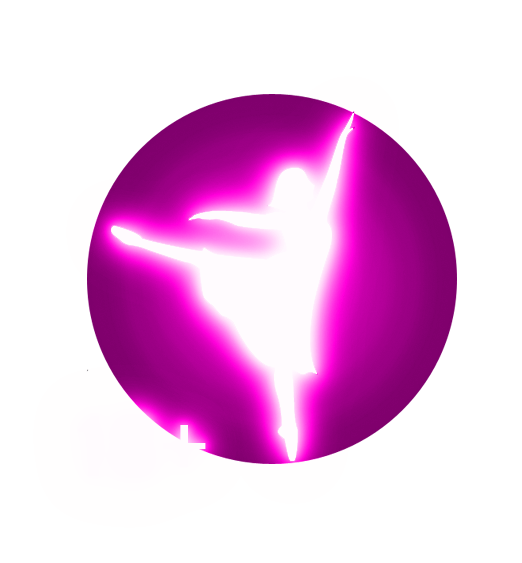

[![Contributors][contributors-shield]][contributors-url]
[![Stargazers][stars-shield]][stars-url]

 

  

  <h3 align="center">Vas-y clique !</h3>

  

    Je ne serai en aucun cas tenu responsable de ce que vous ferez ici, un clique sur un lien reviens à un consentement de votre part à y accéder.
     
    <a href="https://www.youtube.com/watch?v=dQw4w9WgXcQ"><strong>Vas, clique »</strong></a>
     
     
    <a href="https://github.com/othneildrew/Best-README-Template">Là</a>
    ·
    <a href="https://github.com/othneildrew/Best-README-Template/issues">Là</a>
    ·
    <a href="https://github.com/othneildrew/Best-README-Template/issues">Ou là</a>
  

[contributors-shield]: https://img.shields.io/github/contributors/ElsRiri/Best-README-Template.svg?style=for-the-badge
[contributors-url]: https://github.com/othneildrew/Best-README-Template/graphs/contributors
[stars-shield]: https://img.shields.io/github/stars/othneildrew/Best-README-Template.svg?style=for-the-badge
[stars-url]: https://github.com/othneildrew/Best-README-Template/stargazers
